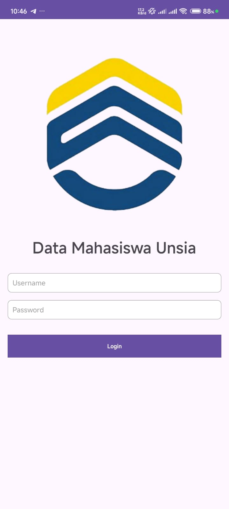
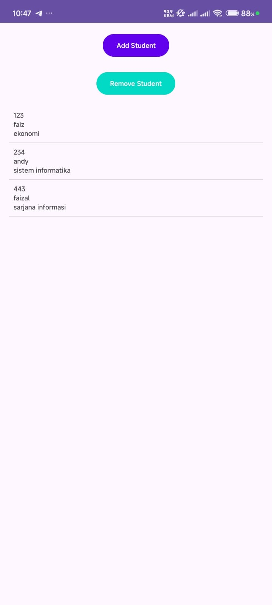
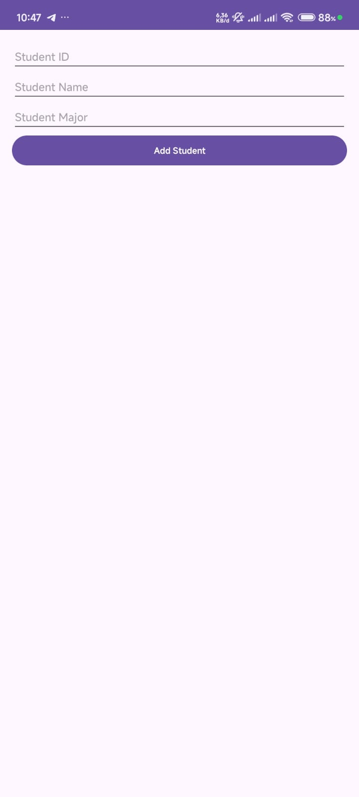

# Student Management App

Student Management App adalah aplikasi Android yang memungkinkan Anda untuk mengelola data mahasiswa dengan mudah. Aplikasi ini dilengkapi dengan fitur login, penambahan data mahasiswa, penghapusan data mahasiswa, dan penyimpanan data menggunakan `SharedPreferences`.

## Fitur

- **Login**: Halaman login untuk mengamankan akses ke aplikasi.
- **Tambah Mahasiswa**: Menambahkan data mahasiswa baru.
- **Hapus Mahasiswa**: Menghapus data mahasiswa yang sudah ada.
- **List Mahasiswa**: Menampilkan daftar mahasiswa yang tersimpan.
- **Penyimpanan Data**: Menggunakan `SharedPreferences` untuk menyimpan data mahasiswa secara lokal.

## Teknologi yang Digunakan

- **Android Studio**: IDE untuk pengembangan aplikasi Android.
- **Java**: Bahasa pemrograman utama untuk aplikasi ini.
- **SharedPreferences**: Untuk menyimpan data mahasiswa secara lokal.

## Screenshot

### Halaman Login

### Daftar Mahasiswa

### Tambah Mahasiswa

